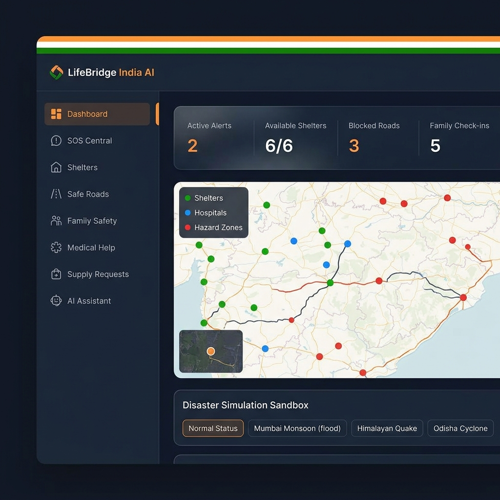
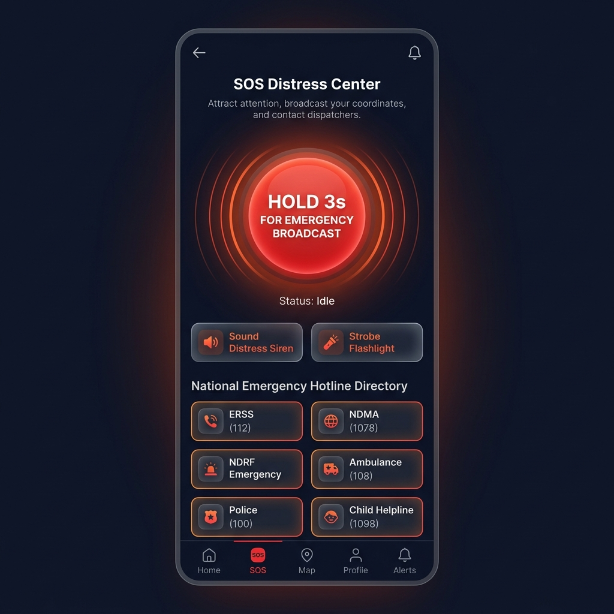
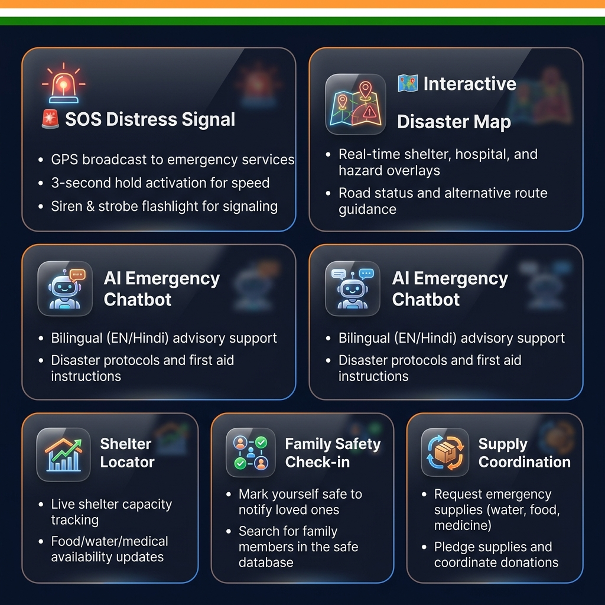
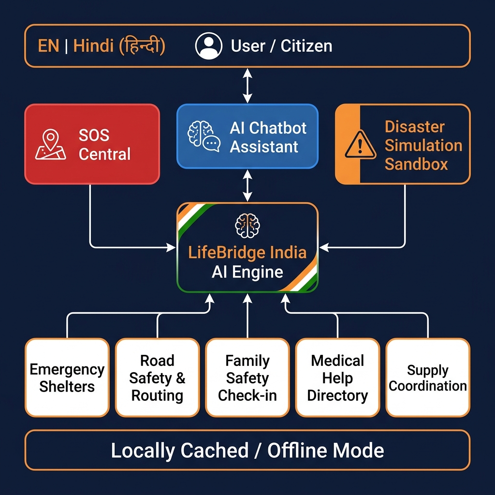

<div align="center">

# 🇮🇳 LifeBridge India AI
### Emergency Response & Disaster Management Platform

[](https://developer.mozilla.org/en-US/docs/Web/HTML)
[](https://developer.mozilla.org/en-US/docs/Web/CSS)
[](https://developer.mozilla.org/en-US/docs/Web/JavaScript)
[](LICENSE)
[]()
[]()

> **A comprehensive, bilingual, offline-capable AI-powered emergency response dashboard designed for India's disaster-prone regions — helping citizens, responders, and coordinators stay informed, connected, and safe during crises.**

</div>

---

## 📸 Application Preview

### 🖥️ Main Dashboard


### 🚨 SOS Distress Center


### ⚡ Core Features Overview


---

## 🔄 Application Workflow



### How It Works — Step by Step

```
Citizen / Rescue Worker
         │
         ▼
┌─────────────────────────────────────────────────────────┐
│              LifeBridge India AI Platform                │
│                                                         │
│  ┌──────────┐  ┌────────────┐  ┌─────────────────────┐ │
│  │  SOS     │  │ Disaster   │  │   AI Chatbot        │ │
│  │  Central │  │ Simulation │  │   (EN / हिन्दी)     │ │
│  └────┬─────┘  └─────┬──────┘  └──────────┬──────────┘ │
│       │               │                    │            │
│  ┌────▼───────────────▼────────────────────▼──────────┐ │
│  │              Core AI Engine                        │ │
│  │   (Real-time data routing & state management)      │ │
│  └────┬──────┬──────┬──────┬──────────────────────────┘ │
│       │      │      │      │                            │
│  ┌────▼─┐ ┌──▼──┐ ┌─▼───┐ ┌▼──────────┐ ┌──────────┐  │
│  │Shelt-│ │Road │ │Fami-│ │ Medical  │ │ Supply  │  │
│  │ ers  │ │Safe-│ │ ly  │ │Directory │ │Coordin- │  │
│  │      │ │  ty │ │Safe-│ │          │ │  ation  │  │
│  └──────┘ └─────┘ └─────┘ └──────────┘ └─────────┘  │
└─────────────────────────────────────────────────────────┘
         │
         ▼
  Locally Cached / Offline Mode (No internet required)
```

---

## 📖 About the Project

**LifeBridge India AI** is a capstone project that addresses one of India's most pressing challenges: effective disaster communication and coordination during emergencies. India faces recurring natural disasters — floods, earthquakes, cyclones, and more — that affect millions of citizens who often lack access to centralized, real-time information.

This platform is built to be:
- 🌐 **Accessible** — Works offline via local caching; no internet dependency for core features
- 🗣️ **Bilingual** — Full English and Hindi (हिन्दी) language support, toggleable on-the-fly
- 📱 **Responsive** — Designed for desktop and mobile use during field operations
- 🤖 **AI-Augmented** — Integrated chatbot provides first-aid, disaster protocols, and shelter routing guidance

---

## ✨ Features

### 📊 1. Emergency Dashboard
- **Real-time stat cards**: Active disaster alerts, available shelter count, blocked roads, family check-ins
- **Interactive Regional Map**: Canvas-based map overlay showing shelters (🟢), hospitals (🔵), hazard zones (🔴), and road conditions (safe/blocked lines)
- **Live Broadcast Feed**: Scrolling incident log with timestamped updates
- **Disaster Simulation Sandbox**: One-click scenarios for:
  - 🛡️ Normal Status
  - 🌊 Mumbai Monsoon Flood
  - 🫨 Himalayan Earthquake (M7.5)
  - 🌀 Odisha Cyclone

### 🚨 2. SOS Distress Center
- **3-second hold SOS button** — Triggers mock GPS broadcast and alerts emergency services
- **Distress Siren** — Plays audible siren alert via Web Audio API
- **Strobe Flashlight** — Screen-based strobe signal to attract attention
- **National Hotline Directory** with one-tap contact for:
  - ERSS (112), NDMA (1078), NDRF, Ambulance (108), Police (100), Women Helpline (1091), Child Helpline (1098)

### 🏠 3. Emergency Shelters
- Browse and filter active relief camps (Open / Full / Has Medical Aid)
- View live capacity, food/water, pet policies, and medical station availability
- **Register a new shelter** form for community centers and coordinators
- Dynamic capacity updates per disaster simulation

### 🚧 4. Safe Roads & Routing
- Real-time road condition filter (Safe / Flooded / Blocked / Landslide)
- **Report a Road Hazard** form for field responders
- Road conditions update dynamically based on active disaster scenario

### 👥 5. Family Safety Check-In
- **Publish Safety Status**: Mark yourself as Safe, In Shelter, Injured, or Stuck
- **Search Database**: Find family members by name, phone number, or current location
- Persistent in-app registry for field coordination

### 🏥 6. Medical Help Directory
- Browse active hospitals, emergency clinics, and NDRF medical teams
- **First Aid Fast-Cards** with instant chatbot integration for:
  - 🩸 Severe Bleeding Triage
  - ☀️ Heat Stroke / Dehydration
  - 🦴 Bone Fracture / Splinting

### 📦 7. Supply Coordination Hub
- Post supply requests (water, food, baby formula, blankets)
- Pledge supplies to active requests
- **Download Offline Guide** for supply management without internet

### 💬 8. AI Emergency Chatbot
- Bilingual conversational assistant (English & Hindi)
- Trained on disaster protocols, evacuation procedures, and first-aid guidance
- Quick-access guide tags:
  - "How to perform CPR?"
  - "Earthquake safety protocol"
  - "Flood water safety guidelines"
  - "Emergency kit essentials"

---

## 🛠️ Tech Stack

| Layer | Technology |
|---|---|
| **Structure** | HTML5 (Semantic) |
| **Styling** | Vanilla CSS3 (Glassmorphism, CSS Variables, Animations) |
| **Logic** | Vanilla JavaScript (ES6+) |
| **Fonts** | Google Fonts — Outfit, Inter |
| **Maps** | HTML5 Canvas API |
| **Audio** | Web Audio API |
| **Storage** | LocalStorage (offline cache) |
| **Language** | Custom i18n translation engine (EN/हिन्दी) |
| **Deployment** | Static HTML — No build tools required |

---

## 🚀 Getting Started

### Prerequisites
- Any modern web browser (Chrome, Firefox, Edge, Safari)
- No npm, no server, no build step required

### Run Locally

```bash
# Clone the repository
git clone https://github.com/akkajedhe-cmd/Capstone-project.git

# Navigate to the project directory
cd Capstone-project

# Open in browser (double-click or use command below)
# On Windows:
start index.html

# On macOS:
open index.html

# On Linux:
xdg-open index.html
```

> ✅ That's it! No dependencies, no installation, no server needed.

---

## 📂 Project Structure

```
Capstone-project/
│
├── index.html          # Main application HTML — all views/sections
├── styles.css          # Complete styling — glassmorphism, animations, theme
├── app.js              # Application logic — state, i18n, simulation engine
│
└── images/             # README assets
    ├── dashboard.png   # Dashboard UI preview
    ├── sos_screen.png  # SOS Distress Center preview
    ├── features.png    # Feature highlights grid
    └── workflow.png    # System architecture workflow diagram
```

---

## 🌍 Bilingual Support

The entire application is fully translated between **English** and **Hindi (हिन्दी)**. Toggle the language using the `EN` / `हिन्दी` buttons in the sidebar. All UI text, form labels, alerts, hotline descriptions, chatbot messages, and status labels switch instantly without page reload.

---

## 🎮 Disaster Simulation Guide

Use the **Simulation Sandbox** on the Dashboard to test the platform's real-time response:

| Scenario | Trigger Effect |
|---|---|
| 🛡️ Normal Status | All alerts cleared, roads safe, full shelter capacity |
| 🌊 Mumbai Monsoon | Red flood alert, 3 roads blocked, 2 shelters at full capacity, map hazards shown |
| 🫨 Himalayan Quake | Critical seismic alert, road landslides, reduced shelter availability |
| 🌀 Odisha Cyclone | Coastal evacuation alert, blocked highways, shelter capacity reduced |

---

## 🔒 Offline Capabilities

LifeBridge India AI is designed to work in **low-connectivity or no-connectivity** scenarios:

- All data is initialized locally in JavaScript — no API calls required
- Shelter, road, family, and supply data persists in-session via LocalStorage
- The AI chatbot operates entirely on locally defined knowledge rules
- The app can be saved and run from a USB drive or local file system

> **"Locally Cached Mode"** indicator is always visible in the sidebar footer.

---

## 🧑‍💻 Developer Notes

- **Single-file architecture**: All views are HTML `<section>` elements toggled via JavaScript — no routing library needed
- **i18n engine**: Custom `translations` dictionary with `data-translate` attributes auto-renders on language switch
- **Simulation engine**: A central `applyScenario()` function propagates state changes across all views simultaneously
- **Canvas map**: Pure HTML5 Canvas — no third-party map library (Leaflet, Google Maps, etc.) used

---

## 🤝 Contributing

Contributions are welcome! Here's how to get started:

1. Fork the repository
2. Create a feature branch: `git checkout -b feature/your-feature-name`
3. Commit your changes: `git commit -m "feat: add your feature"`
4. Push to branch: `git push origin feature/your-feature-name`
5. Open a Pull Request

---

## 📄 License

This project is licensed under the **MIT License** — see the [LICENSE](LICENSE) file for details.

---

<div align="center">

**Built with ❤️ for India's emergency responders and citizens**

🇮🇳 *Jai Hind* 🇮🇳

</div>
